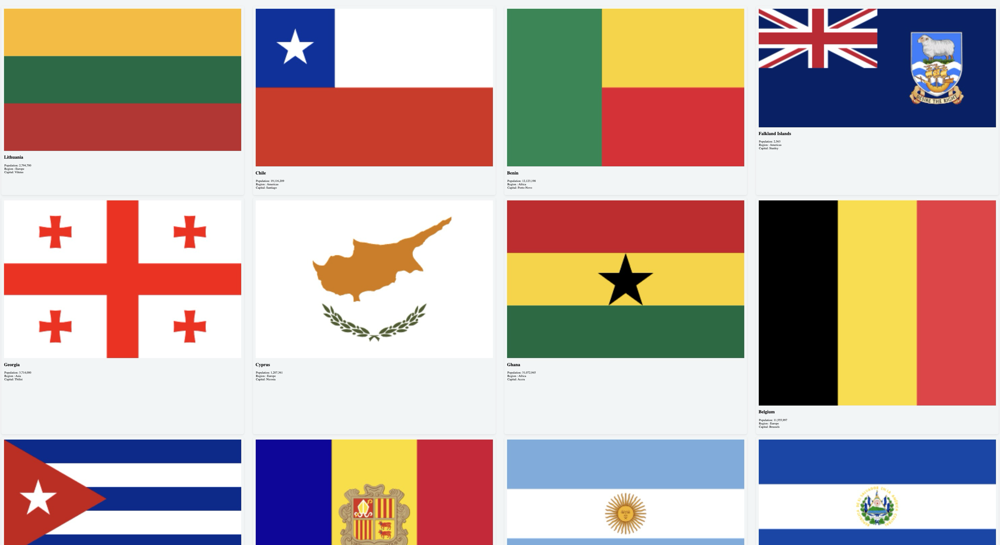
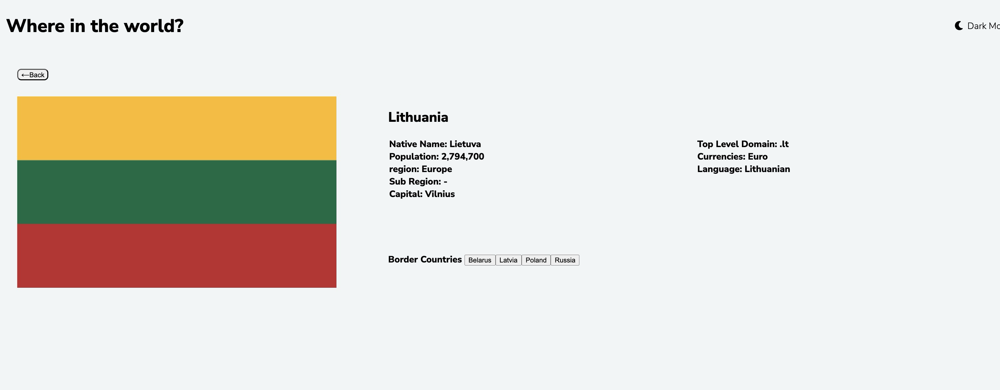

# Frontend Mentor - REST Countries API with color theme switcher solution

This is a solution to the [REST Countries API with color theme switcher challenge on Frontend Mentor](https://www.frontendmentor.io/challenges/rest-countries-api-with-color-theme-switcher-5cacc469fec04111f7b848ca). Frontend Mentor challenges help you improve your coding skills by building realistic projects. 

## Table of contents

- [Overview](#overview)
  - [The challenge](#the-challenge)
  - [Screenshot](#screenshot)
  - [Links](#links)
- [My process](#my-process)
  - [Built with](#built-with)
  - [What I learned](#what-i-learned)
  - [Continued development](#continued-development)
  - [Useful resources](#useful-resources)
- [Author](#author)
- [Acknowledgments](#acknowledgments)

**Note: Delete this note and update the table of contents based on what sections you keep.**

## Overview:

This project shows the countries in the 4 columns , each country shows flag , name, population, Region and Capital.
It has two field in nav bar: search by name and filter on Region

### The challenge

Users should be able to:

- See all countries from the API on the homepage
- Search for a country using an `input` field
- Filter countries by region
- Click on a country to see more detailed information on a separate page
- Click through to the border countries on the detail page
- The pages are designed for responsive mode also (mobile)

### Screenshot

](./screenshot.jpg)



### Links

- Solution URL:  https://github.com/Shahla92500/rest-countries-api
- Live Site URL:http://127.0.0.1:5500/mod7/rest-countries-api/index.html

## My process
- See all countries from the API on the homepage
- Search for a country using an `input` field
- Filter countries by region
- Click on a country to see more detailed information on a separate page
- Click through to the border countries on the detail page
- The pages are designed for responsive mode also (mobile) => almost work fine

### Built with

- Semantic HTML5 markup
- Java Script
- rest
- CSS custom properties
- Flexbox
- CSS Grid
- Mobile-first workflow

- [styles.css]- For styles


### What I learned

Use this section to recap over some of your major learnings while working through this project. Writing these out and providing code samples of areas you want to highlight is a great way to reinforce your own knowledge.

To see how you can add code snippets, see below:

```html
<h1>Some HTML code I'm proud of is :function=> "attachCountryCardHandlers" and displayCountry.js </h1>
```
```css
.proud-of-this-css {
  color: papayawhip;
}
```
```js
const proudOfThisFunc = () => {
  console.log('🎉')
}
```


### Continued development

I will continue on work on :
 - layer adjusment by CSS & TailWind
 - Responsive mode to have better result and be faster
 - Dark mode using React

### Useful resources

- Abraham guideline- This helped me for understanding creating a template and use it dynamically. I really liked this pattern and will use it going forward.
- https://developer.mozilla.org/en-US/docs/Web/API/Window/sessionStorage - This is an amazing article which helped me finally understand how to pass the values of one html page to another. I'd recommend it to anyone still learning this concept.
- https://perscholas.instructure.com/courses/2908/pages/module-6-typescript-and-advanced-javascript?module_item_id=2321827 is a greate ressource to understant script Type.


## Author

- Shahla Afshar 

## Acknowledgments

This is where you can give a hat tip to anyone who helped you out on this project. Perhaps you worked in a team or got some inspiration from someone else's solution. This is the perfect place to give them some credit.

Thank you to all team , classmate, and thank you Abraham and Colton
